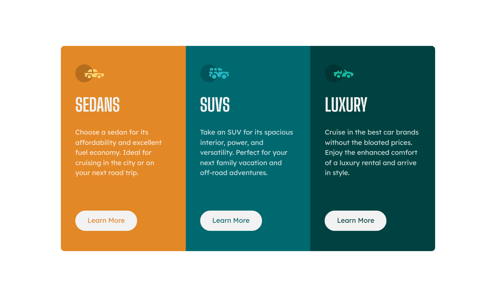

# Frontend Mentor - 3-column preview card component solution

This is a solution to the [3-column preview card component challenge on Frontend Mentor](https://www.frontendmentor.io/challenges/3column-preview-card-component-pH92eAR2-). Frontend Mentor challenges help you improve your coding skills by building realistic projects.

## Table of contents

- [Overview](#overview)
  - [The challenge](#the-challenge)
  - [Screenshot](#screenshot)
  - [Links](#links)
- [My process](#my-process)
  - [Technology Used](#technology-used)
  - [Folder Structure](#folder-structure)
- [Author](#author)

## Overview

### The challenge

Users should be able to:

- View the optimal layout depending on their device's screen size
- See hover states for interactive elements

### Screenshot



### Links

- **Solution:** [frontendmentor.io/solutions/responsive-3column-preview-card-component-YXBX3qnMOP](https://www.frontendmentor.io/solutions/responsive-3column-preview-card-component-YXBX3qnMOP)
- **Live Site:** [fem-3-column-card.pages.dev](https://fem-3-column-card.pages.dev/)

## My process

### Technology Used

This project was built using the following frontend technologies and methodologies:

- **Semantic HTML5 markup:** To provide a clear and meaningful structure to the content.
- **CSS custom properties:** To efficiently manage and reuse style values throughout the project.
- **CSS Grid:** To create powerful and flexible layouts with precise control over placement and alignment.
- **Flexbox:** To create flexible and responsive layouts.
- **Mobile-first workflow:** To ensure a better user experience on smaller screens and devices.

### Folder Structure

```markdown
./
├─ assets/
│ ├─ css/
│ └─ images/
├─ screenshots/
├─ README.md
└─ index.html
```

## Author

This project was created by **Fortune Iyoha**, a passionate web developer. If you want to connect with me or view more of my projects, you can visit my [Frontend Mentor profile](https://www.frontendmentor.io/profile/fortune-i-o) or follow me on [Twitter](https://twitter.com/fortuneiyoha) for updates and web development discussions.
